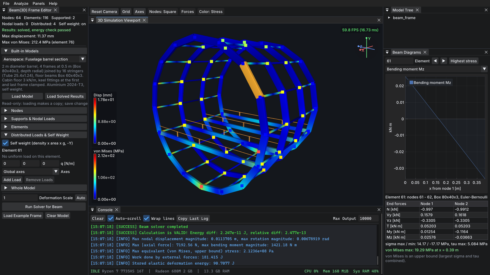

# ANAFINEN

**Analyze Finite Element Engineering**: an open-source 3D finite element analysis engine and visualizer, written in C++23 with an OpenGL 4.6 GUI. *Under active development.*

<!-- Release & Downloads Badges -->
[](https://github.com/suacayipkisi/anafinen/releases/latest)
[](https://github.com/suacayipkisi/anafinen/releases)



*A built-in model (aircraft fuselage barrel section, aluminium 2024-T3) solved with 3D beam elements: real cross-sections colored by von Mises stress, bending moment diagram of the selected element, and the solver log with the energy check.*

## Features

- **3D truss solver** (released, v0.1.3-alpha): static displacement, axial force and stress under nodal loads and self weight; inclined supports.
- **3D beam / frame solver** (in development, v0.2.0):
  - Euler-Bernoulli and Timoshenko elements (no shear locking), chosen per element.
  - Cross-section library: rectangle, circle, pipe, box, I with fillets; a catalogue of 118 standard profiles (IPE, HEA, HEB, CHS, SHS, RHS, ...).
  - Uniform and self-weight loads, nodal forces and moments, inclined supports, end releases (hinges) by static condensation.
  - Exact displacement and N / V / T / M diagrams along each element; normal, shear and von Mises stresses with a yield check.
- **Solvers:** sparse direct (SuiteSparse CHOLMOD or Eigen LDLT) and an OpenMP block conjugate gradient solver for large models; every solve is checked by an energy balance (external work = 2 × strain energy).
- **File formats:** Gmsh MSH, legacy VTK, VTU and ParaView `.pvd`; STEP, IGES and BREP through Gmsh + OpenCASCADE (import and export); HDF5 array store readable from Python / MATLAB.
- **GUI:** Dear ImGui docking interface, instanced rendering of real beam sections with level of detail, picking, model and section editors, diagrams with ImPlot.
- **Built-in models:** 46 beam / frame models (buildings, bridges, machines, aerospace, hinged structures) and a truss library, each tested against the generator.
- **Tests:** closed-form checks (cantilevers, clamped beams, three-hinged frame, published section tables) and file round trips through every format, on GCC and Clang with zero warnings.

Documentation, design decisions and progress are in the [`information/`](information/ARCHITECTURE.md) folder.

## Roadmap

1. Static displacement under applied force: trusses done, beams / frames in development
2. Modal analysis
3. Heat transfer
4. Nonlinear elasticity
5. CFD (computational fluid dynamics)

## 📦 Downloads (v0.1.3-alpha)

Pre-compiled binary releases for Windows and Linux are available under [GitHub Releases](https://github.com/suacayipkisi/anafinen/releases). The latest release contains the truss solver; the beam solver comes with v0.2.0.

| Platform | File | Quick Run / Install Command |
| --- | --- | --- |
| **Windows** (10/11 x64 Portable) | [`anafinen-0.1.3-windows-AMD64-alpha.zip`](https://github.com/suacayipkisi/anafinen/releases/download/v0.1.3-alpha/anafinen-0.1.3-windows-AMD64-alpha.zip) | Extract the `.zip` into a folder you can write to (not `Program Files`) and run `anafinen.exe`. Needs the [Microsoft Visual C++ 2015-2022 Redistributable (x64)](https://aka.ms/vs/17/release/vc_redist.x64.exe) |
| **Linux** (Fedora / RHEL / RPM-based) | [`anafinen-0.1.3-alpha.rpm`](https://github.com/suacayipkisi/anafinen/releases/download/v0.1.3-alpha/anafinen-0.1.3-alpha.rpm) | `sudo dnf install ./anafinen-0.1.3-alpha.rpm` |
| **Linux** (Debian / Ubuntu / DEB-based) | [`anafinen-0.1.3-alpha.deb`](https://github.com/suacayipkisi/anafinen/releases/download/v0.1.3-alpha/anafinen-0.1.3-alpha.deb) | `sudo apt install ./anafinen-0.1.3-alpha.deb` |
| **Linux** (Arch/CachyOS/Arch-based) | [`anafinen-0.1.3_alpha-1-x86_64.pkg.tar.zst`](https://github.com/suacayipkisi/anafinen/releases/download/v0.1.3-alpha/anafinen-0.1.3_alpha-1-x86_64.pkg.tar.zst) | `sudo pacman -U anafinen-0.1.3_alpha-1-x86_64.pkg.tar.zst` (needs `gmsh` or `gmsh-bin` from the AUR) |

## References

This is an educational project; the theory follows these books:
- D. L. Logan, *A First Course in the Finite Element Method*, 5th ed.
- K.-J. Bathe, *Finite Element Procedures*, 1996
- G. H. Golub, C. F. Van Loan, *Matrix Computations*, 4th ed.
- S. S. Rao, *Mechanical Vibrations*, 5th ed.

## AI Assistance

Parts of this project were developed with the help of an AI coding assistant, mainly for:
- **File handling:** the `anaf_io` library (MSH / VTK / VTU / STEP / IGES / BREP import and export, async I/O)
- **GUI:** panels such as the model editor, import / export dialogs and status bar
- **Tests:** the `anaf_io` and truss test suites and the built-in truss library checks

The FEM theory, the solver design and the overall architecture are my own work, based on the books above. All AI-assisted code is reviewed (some of it is still under review), built and tested before it is committed.

## Libraries
- Calculation: Eigen, Spectra, SuiteSparse CHOLMOD
- Visualisation and GUI: OpenGL, GLAD, GLFW, Dear ImGui, ImGuizmo, ImPlot, glm, portable-file-dialogs
- File formats (import/export): Gmsh MSH 1/2.2/4.0/4.1, VTK legacy 2.0-5.1, VTK XML (.vtu), STEP/IGES/BREP (via Gmsh + OpenCASCADE)
- Binary matrix / vector / tensor files: HDF5 (C API; readable by h5py, SciPy, MATLAB)
- Multithreading: OpenMP and threaded SuiteSparse/BLAS backends

# Build (Windows and Linux)

macOS is not supported (no test hardware).

## Windows

- Open cmd or PowerShell; Git must be installed.

### Clone This Repo

```cmd
git clone --recursive https://github.com/suacayipkisi/anafinen.git
```

`--recursive` also fetches the submodules (Dear ImGui, ImPlot, ImGuizmo, Spectra). For an existing clone run `git submodule update --init --recursive` inside `anafinen`.

### Install vcpkg

```cmd
git clone https://github.com/microsoft/vcpkg.git
cd vcpkg
.\bootstrap-vcpkg.bat
.\vcpkg integrate install
```

### Install Libraries

Calculation libs:
```cmd
.\vcpkg install eigen3:x64-windows
.\vcpkg install spectra:x64-windows
.\vcpkg install suitesparse:x64-windows
.\vcpkg install hdf5:x64-windows
```

HDF5 is required. vcpkg builds it once into `installed/x64-windows`; the anafinen
build only links it, and the packaging script copies `hdf5.dll` into the ZIP.

SuiteSparse is optional at configure time. When its headers and libraries are
found, the build uses Eigen's CHOLMOD backend; otherwise it uses Eigen's
built-in sparse LDLT solver.

Windows builds use MSVC with vcpkg; a MinGW (cross-)build is not supported.

GUI and visualization:
```cmd
.\vcpkg install glfw3:x64-windows
.\vcpkg install glad:x64-windows
.\vcpkg install "imgui[core,docking-experimental,glfw-binding,opengl3-binding]:x64-windows" --recurse
.\vcpkg install implot:x64-windows
.\vcpkg install imguizmo:x64-windows
.\vcpkg install libpng:x64-windows
.\vcpkg install glm:x64-windows
.\vcpkg install nlohmann-json:x64-windows
```

Mesh engine:  
- vcpkg usually has no working Gmsh; download the SDK instead:  
- https://gmsh.info/bin/Windows/?C=M;O=D  
- As of 2 Sep 2026 the latest is "gmsh-4.15.2-Windows64-sdk.zip". Do not use the git snapshots.  
- Extract the `.zip` anywhere, for example `C:\libs\gmsh-sdk` (the folder must contain `bin`, `include`, `lib` and `share`).
- CMake finds the SDK and vcpkg on its own, on any drive: `GMSH_SDK_DIR` / `VCPKG_ROOT` environment variables, `vcpkg` on `PATH`, then folders such as `<drive>:\libs\gmsh-sdk`, `<drive>:\gmsh-*-Windows64-sdk` and `<drive>:\vcpkg`. The configure log prints what it found (`Gmsh SDK auto-detected: ...`). For any other location set `GMSH_SDK_DIR` (environment variable or `-DGMSH_SDK_DIR=...`). Details: [information/BUILD_SYSTEM.md](information/BUILD_SYSTEM.md) section 5.2.

### Finally Open Visual Studio

- Open the folder as a CMake project and select an **x64** configuration (a 32-bit kit stops at configure time with a message).
- The vcpkg toolchain is detected automatically. Only for an unusual location, open Project -> CMake Settings and set the CMake toolchain file to `<your vcpkg folder>/scripts/buildsystems/vcpkg.cmake`, then press ctrl+s.
- Check that the configure step succeeds.

### Start to Build

- Press Ctrl+Shift+B to build.
- Press F5 to run with the debugger, or Ctrl+F5 to run without it.

## Linux

Build instructions are provided for Fedora, Arch/CachyOS, and Debian/Ubuntu.
When SuiteSparse development files are available, CMake automatically enables
Eigen's CHOLMOD backend; otherwise it falls back to Eigen's built-in sparse
LDLT solver.

Other distributions are not tested; reports of a successful build are welcome.

### Libraries

#### Libraries Fedora

```bash
sudo dnf install -y \
    gcc-c++ \
    cmake \
    ninja-build \
    git \
    eigen3-devel \
    suitesparse-devel \
    mesa-libGL-devel \
    gmsh-devel \
    glfw-devel \
    spectra-devel \
    libpng-devel \
    zlib-devel \
    json-devel \
    hdf5-devel \
    glm-devel \
    librsvg2-tools \
    ImageMagick \
    zenity
```

#### Libraries Arch-CachyOS
```bash
# Spectra comes from the git submodule (it is not in the official repos); OpenMP is GCC's libgomp (gcc-libs).
sudo pacman -S glibc gcc-libs eigen suitesparse glfw mesa cmake ninja git glm libpng zlib nlohmann-json hdf5 librsvg zenity

# gmsh comes from the AUR (user-maintained packages): review the PKGBUILD before installing,
# or use the official Gmsh SDK from gmsh.info as on Windows.
paru -S gmsh-bin
```

#### Libraries Debian-Ubuntu
```bash
sudo apt-get update
sudo apt-get install -y cmake ninja-build build-essential pkg-config libeigen3-dev libsuitesparse-dev libpng-dev libglfw3-dev libgmsh-dev libspectra-dev libgl1-mesa-dev libglm-dev zlib1g-dev nlohmann-json3-dev libhdf5-dev librsvg2-bin zenity
```

### Clone This Repo

```bash
# at your project folder -> cd ../(your projects location)
git clone https://github.com/suacayipkisi/anafinen.git
```

### Submodules

```bash
# at ../anafinen
git submodule update --init --recursive
```

### Start Build
```bash
cmake -B build -G Ninja -DCMAKE_BUILD_TYPE=Release
cmake --build build
```

File > Import / Export uses the desktop's own file chooser: install `zenity` (GNOME and most desktops) or `kdialog` (KDE).

### Tests (optional)
```bash
cmake -B build -G Ninja -DCMAKE_BUILD_TYPE=Release -DANAFINEN_BUILD_TESTS=ON
cmake --build build
cd build && ctest --output-on-failure
```
With the Python `vtk` package installed, the tests also cross-check every VTK/VTU variant against the official VTK library.

## Packaging

- Linux: `./package/package.sh` picks RPM (Fedora), pacman (Arch / CachyOS) or DEB (Debian / Ubuntu) by itself.
- Debian and Arch packages can also be built in clean containers (podman or docker): `package/tools/container-check.sh all package`. The packages land in `build-containers/<distro>/`.
- Windows: `package/package-windows.ps1` builds a Release binary and the portable `.zip` (CPack).

See [package/PACKAGE_BUILD.md](package/PACKAGE_BUILD.md) for details.


## Licensing & Third Party Library and Font Licenses

This project is open-source software licensed under the **GNU General Public License v3.0 (GPLv3)**.

Copyright (c) 2026 Abdurrahman Konuk, professionally known as Ufuk Deniz Konuk. Both names refer to the same person, the sole copyright holder of this project; "Ufuk Deniz Konuk" is used in source headers, packages and releases. See the [LICENSE](LICENSE) and [THIRD_PARTY_LICENSES.md](THIRD_PARTY_LICENSES.md) file for details.

### Commercial & Enterprise Licensing

**Using anafinen is free under the GPLv3, including commercial use.** Companies may run it for engineering work, sell services or reports produced with it, and modify it for internal use without publishing their changes. The GPLv3 obligations (providing the source code under the GPLv3) apply only when the program, or software containing it, is **distributed** to others.

A separate commercial license is needed only to **embed anafinen in a proprietary, closed-source product and distribute that product** without the GPLv3 copyleft terms. Such licenses and custom support agreements are available from the copyright holder.

A commercial license covers anafinen's own code only. Third-party components licensed under the GPL are not the copyright holder's to relicense:
- Gmsh (used for CAD meshing)
- the GPL modules of SuiteSparse CHOLMOD (optional solver)

A commercially licensed build either excludes these components, or the licensee obtains their licenses separately. Permissively licensed components (MIT, zlib, MPL-2.0, LGPL with dynamic linking) keep their own notice requirements; see [THIRD_PARTY_LICENSES.md](THIRD_PARTY_LICENSES.md).

For commercial inquiries: `konuki8523@gmail.com`

### Contributing
Contributions are welcome. By submitting a pull request, you agree to our [Contributor License Agreement (CLA)](.github/CLA.md), granting the maintainer the right to re-license contributions under both GPLv3 and commercial terms.
